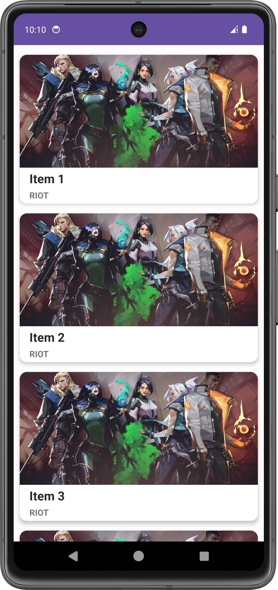

# Recycler View
RecyclerView makes it easy to efficiently display large sets of data. You supply the data and define how each item looks, and the RecyclerView library dynamically creates the elements when they're needed. As the name implies, RecyclerView recycles those individual elements.

# Card View in Android Studio
Android CardView UI component shows information inside cards. This component is generally used to show contact information. This component is available in another support library so we have to add its dependency too.

# Image

Sampai saat ini, percobaan yang dilakukan belum mampu sesuai harapan. Antara lain :

- Data teks yang ditampilkan tidak sama
- Data gambar yang ditampilkan tidak sama
- Data yang ditampilkan didapat dari API public
